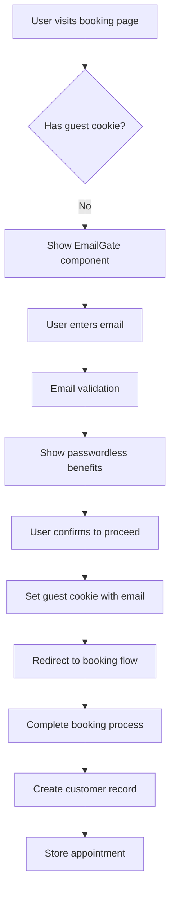
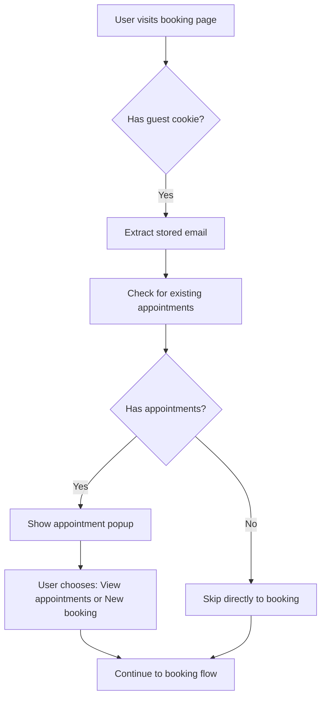

# Passwordless Account Management System
**Boondocks Barbershop Booking System**

## Table of Contents
1. [System Overview](#system-overview)
2. [Architecture](#architecture)  
3. [User Flow](#user-flow)
4. [Cookie Management](#cookie-management)
5. [API Endpoints](#api-endpoints)
6. [Components](#components)
7. [Security Considerations](#security-considerations)
8. [Benefits of the Approach](#benefits-of-the-approach)

---

## System Overview

The Boondocks Barbershop booking system implements a **passwordless account management approach** that eliminates the need for traditional user accounts while providing a streamlined booking experience. Instead of requiring users to create accounts with passwords, the system uses email-based identification combined with browser cookies to create a frictionless booking flow.

### Core Concept
- **Guest Booking Flow**: All users book as "guests" without creating traditional accounts
- **Email-Based Identity**: Customer identity is tied to email address only
- **Cookie-Based Persistence**: Browser cookies remember user preferences and enable faster return visits
- **Appointment Ownership**: Customers can view and manage their appointments using only their email address

### Key Features
- No password creation or management required
- Automatic email prefilling for return visitors
- Seamless appointment lookup by email
- Privacy-compliant cookie management
- Cross-session booking continuity

---

## Architecture

The passwordless system is built on several interconnected components that work together to provide a seamless experience:

### High-Level Architecture

```
┌─────────────────┐    ┌─────────────────┐    ┌─────────────────┐
│   Email Gate    │ -> │  Cookie Manager │ -> │ Booking Process │
│  (First Visit)  │    │   (Persistence) │    │   (Seamless)    │
└─────────────────┘    └─────────────────┘    └─────────────────┘
         |                        |                        |
         v                        v                        v
┌─────────────────┐    ┌─────────────────┐    ┌─────────────────┐
│  Email Validation│    │ Browser Storage │    │ Customer Records│
│  & Confirmation  │    │  (1 Year TTL)  │    │  (Database)     │
└─────────────────┘    └─────────────────┘    └─────────────────┘
```

### Data Flow

1. **First-Time Users**:
   - Enter email at EmailGate component
   - System validates email format
   - Cookie is set with guest booking permission
   - User proceeds to booking flow

2. **Return Users**:
   - Cookie is detected on page load
   - Email is auto-populated from cookie
   - EmailGate is bypassed automatically
   - Direct access to booking interface

3. **Appointment Management**:
   - Users can lookup appointments by email
   - System retrieves all associated bookings
   - No authentication beyond email verification required

### Technical Stack
- **Frontend**: Next.js 14 with React components
- **Backend**: Next.js API routes
- **Database**: Prisma ORM with customer and appointment entities
- **Storage**: HTTP-only cookies for persistence
- **Security**: SameSite cookies, HTTPS enforcement

---

## User Flow

### New User Journey



### Returning User Journey



### Step-by-Step User Experience

#### First Visit
1. **Landing**: User arrives at booking page
2. **Email Gate**: Prompted to enter email address
3. **Validation**: System validates email format
4. **Confirmation**: User sees passwordless benefits explanation
5. **Consent**: User chooses to continue with guest booking
6. **Cookie Set**: Browser stores guest booking permission
7. **Booking**: User proceeds through service/provider/time selection
8. **Customer Form**: User fills out contact information (email pre-filled)
9. **Completion**: Appointment created, confirmation sent

#### Return Visit  
1. **Auto-Detection**: System detects existing cookie
2. **Email Recognition**: Stored email is retrieved
3. **Appointment Check**: System looks for existing appointments
4. **Smart Routing**: 
   - If appointments exist: Show management popup
   - If no appointments: Direct to booking
5. **Streamlined Booking**: Email pre-filled throughout process

---

## Cookie Management

The system uses a sophisticated cookie management approach that respects user privacy while enabling functionality.

### Cookie Structure

The system stores a JSON object in the `boondocks_guest_booking` cookie:

```typescript
interface GuestCookieData {
  allowed: boolean;           // Guest booking permission flag
  email?: string;            // User's email for prefilling
  firstSet: string;          // ISO date when cookie was first created
  version: number;           // Cookie schema version for migrations
}
```

### Cookie Properties
- **Name**: `boondocks_guest_booking`
- **Expiry**: 1 year from creation
- **Path**: `/` (site-wide access)
- **SameSite**: `Lax` (prevents CSRF while allowing navigation)
- **Secure**: Enabled on HTTPS connections
- **HttpOnly**: Not set (JavaScript needs access for client-side logic)

### Cookie Manager Features

#### Automatic Detection
```typescript
// Check if user has guest booking enabled
const isAllowed = isGuestBookingAllowed();
const storedEmail = getStoredEmail();
```

#### Smart Prefilling
```typescript
// Auto-fill email on form load
useEffect(() => {
  const storedEmail = getStoredEmail();
  if (storedEmail) {
    setEmail(storedEmail);
  }
}, []);
```

#### Privacy Controls
- Users can view cookie status in footer
- Clear cookie functionality available
- No personal data stored beyond email
- Automatic expiration after 1 year

#### Browser Compatibility
- Cookie availability detection
- Graceful fallback when cookies disabled
- Cross-browser compatibility ensured

### Privacy Compliance

The cookie implementation follows privacy best practices:

1. **Minimal Data**: Only stores essential booking preference
2. **User Control**: Clear privacy notice and cookie clearing option  
3. **Automatic Cleanup**: Cookies expire automatically
4. **No Tracking**: No third-party tracking or analytics cookies
5. **Transparent Storage**: Users can see exactly what's stored

---

## API Endpoints

### Core Booking Endpoints

#### Customer Management

**`POST /api/customers`**
- Creates or updates customer records
- Handles email-based customer identification
- Returns customer object for appointment creation

```typescript
// Request body
{
  firstName: string,
  lastName: string,
  email: string,
  phone: string,
  notes?: string,
  marketingConsent: boolean,
  smsConsent: boolean
}

// Response
{
  customer: {
    id: string,
    email: string,
    firstName: string,
    lastName: string,
    // ... other fields
  }
}
```

**`GET /api/customers/check-email?email={email}`**
- Validates email format
- Checks if customer already exists
- Used for duplicate detection

```typescript
// Response
{
  exists: boolean,
  email: string
}
```

#### Appointment Management

**`POST /api/appointments`**
- Creates new appointments
- Links to customer via email
- Handles conflict detection

**`GET /api/appointments/by-email?email={email}&upcoming={bool}&past={bool}`**
- Retrieves all appointments for an email address
- Supports filtering by upcoming/past appointments
- Central endpoint for appointment management

```typescript
// Response
{
  appointments: Appointment[],
  hasUpcoming: boolean,
  hasPast: boolean,
  customer: Customer
}
```

**`GET /api/appointments/{id}`**
- Retrieves specific appointment details
- Used for appointment modification/cancellation

### Authentication-Free Design

The API design eliminates traditional authentication requirements:

1. **Email as Identity**: All lookups based on email address
2. **No Session Management**: Each request is self-contained
3. **Minimal Security**: Basic email validation only
4. **Public Access**: Most endpoints require only email parameter
5. **Rate Limiting**: Protected by Next.js built-in rate limiting

### Error Handling

Consistent error responses across all endpoints:

```typescript
// Error response format
{
  error: string,          // Human-readable error message
  code?: string,         // Optional error code
  details?: any          // Optional additional context
}
```

Common error scenarios:
- Invalid email format (400)
- Customer not found (404)
- Appointment conflicts (409)
- Server errors (500)

---

## Components

### Core Components

#### EmailGate Component
**Location**: `/components/EmailGate.tsx`

The entry point for new users that handles the passwordless onboarding flow.

**Key Features**:
- Email validation and formatting
- Passwordless benefits explanation
- Cookie creation and management
- Smooth transition to booking flow

**Props**:
```typescript
interface EmailGateProps {
  onGuestProceed: () => void;
  onExistingUserProceed: (email: string) => void;
}
```

**State Management**:
- Email input validation
- Loading states during processing
- Error handling for invalid inputs
- Confirmation dialog management

#### CookieManager Component  
**Location**: `/components/CookieManager.tsx`

Provides user control over cookie preferences and privacy settings.

**Display Modes**:
- **Footer Widget**: Compact cookie status indicator
- **Full Page**: Detailed cookie management interface

**Features**:
- Real-time cookie status display
- Cookie age calculation
- One-click cookie clearing
- Privacy information display
- Browser compatibility warnings

#### CustomerInfoForm Component
**Location**: `/components/CustomerInfoForm.tsx`

Handles customer information collection with smart email prefilling.

**Smart Features**:
- Automatic email prefilling from cookie
- Email change functionality for return users
- Form validation and error handling
- Consent management for communications

**Email Handling**:
```typescript
// Auto-fill from cookie on load
useEffect(() => {
  if (prefilledEmail) {
    setFormData(prev => ({ ...prev, email: prefilledEmail }));
  }
}, [prefilledEmail]);

// Show different UI for cookie-based emails
{emailFromCookie && !showChangeEmail ? (
  <div>Email from previous visit: {email}</div>
) : (
  <input type="email" />
)}
```

### Supporting Components

#### AppointmentManagementPopup
**Location**: `/components/AppointmentManagementPopup.tsx`

Displays existing appointments and provides management options for returning users.

**Features**:
- Appointment history display
- Upcoming vs. past appointment separation  
- Reschedule/cancel functionality
- "Book Again" quick actions

#### BookingForm Components
**Location**: Various booking-related components

The main booking interface that benefits from the passwordless system:

- **ServiceSelector**: Service selection interface
- **ProviderSelector**: Barber selection with availability
- **TimeSlotPicker**: Date/time selection
- **BookingConfirmation**: Final confirmation and receipt

### Component Integration

The components work together to create a cohesive passwordless experience:

```typescript
// Main booking flow orchestration
const [currentStep, setCurrentStep] = useState<BookingStep>('email-gate');

// Auto-skip email gate for return users
useEffect(() => {
  const guestAllowed = isGuestBookingAllowed();
  const storedEmail = getStoredEmail();
  
  if (guestAllowed && storedEmail) {
    setCurrentStep('service-selection');
    checkForExistingAppointments(storedEmail);
  }
}, []);
```

### Design Patterns

#### Progressive Enhancement
- Basic functionality works without cookies
- Enhanced features enabled with cookie support
- Graceful degradation for disabled cookies

#### State Management
- Minimal global state required
- Cookie serves as persistent state layer
- Component-level state for UI interactions

#### User Experience Patterns
- Loading states during async operations
- Clear visual feedback for user actions
- Consistent error handling across components

---

## Security Considerations

### Threat Model

The passwordless system addresses several security concerns while introducing some trade-offs:

#### Protected Against
- **Password-based attacks**: No passwords to steal or crack
- **Credential stuffing**: No login credentials to compromise  
- **Password reuse**: Users can't reuse weak passwords
- **Brute force attacks**: No login attempts to target
- **Account lockouts**: No complex account recovery needed

#### Potential Vulnerabilities
- **Email access compromise**: If email is compromised, appointments are accessible
- **Cookie theft**: Malicious scripts could access booking cookies
- **Email enumeration**: System reveals if email has appointments
- **Session fixation**: Cookies persist across browser sessions

### Security Measures Implemented

#### Cookie Security
```typescript
// Secure cookie configuration
document.cookie = `${COOKIE_NAME}=${data}; expires=${expiry}; path=/; SameSite=Lax; Secure=${isHTTPS}`;
```

- **SameSite=Lax**: Prevents CSRF attacks
- **Secure flag**: Enforced on HTTPS connections
- **Controlled expiration**: 1-year automatic cleanup
- **Path restriction**: Limited to application paths

#### Input Validation
```typescript
// Email validation on both client and server
const emailRegex = /^[^\s@]+@[^\s@]+\.[^\s@]+$/;
if (!emailRegex.test(email)) {
  return { error: 'Invalid email format' };
}
```

- Server-side email format validation
- Client-side input sanitization
- SQL injection prevention through Prisma ORM
- XSS prevention through React's built-in escaping

#### Data Minimization
- Only essential data stored in cookies
- No sensitive information in client storage  
- Limited data retention periods
- Automatic cleanup of expired records

#### Rate Limiting
- Next.js built-in request rate limiting
- API endpoint throttling
- Abuse prevention mechanisms
- Error rate monitoring

### Privacy Protection

#### GDPR Compliance
- Minimal data processing
- Clear consent mechanisms  
- User control over data storage
- Right to data deletion (cookie clearing)

#### Data Handling
- No password storage required
- Limited personal data collection
- Explicit consent for marketing communications
- Transparent privacy practices

### Risk Mitigation

#### Email Security Dependency
**Risk**: System security depends on email account security
**Mitigation**: 
- Clear user education about email security
- Encourage strong email passwords
- Consider 2FA recommendations for email providers

#### Cookie Manipulation
**Risk**: Users or malicious scripts could modify cookies
**Mitigation**:
- Server-side validation of all data
- Cookie content validation
- Version control for cookie schema changes

#### Public Computer Usage
**Risk**: Cookies persist on shared computers
**Mitigation**:
- Clear cookie expiration warnings
- Easy cookie clearing interface
- Session timeout considerations

---

## Benefits of the Approach

### User Experience Benefits

#### Friction Reduction
- **No registration required**: Users can book immediately
- **No password management**: Eliminates forgotten password issues  
- **Faster return visits**: Email auto-population saves time
- **Simplified flow**: Fewer steps from arrival to booking

#### Accessibility Improvements
- **Lower cognitive load**: No password complexity requirements
- **Better mobile experience**: No tiny password fields or keyboards
- **Reduced abandonment**: Fewer exit points in booking flow
- **Universal compatibility**: Works across all devices and browsers

#### User Retention
- **Return user recognition**: Cookie enables personalized experience
- **Appointment history**: Easy access to past bookings
- **Seamless rebooking**: "Book again" functionality
- **Reduced support calls**: Fewer account-related issues

### Business Benefits

#### Operational Efficiency
- **Reduced support overhead**: No password reset requests
- **Lower development complexity**: No authentication system to maintain
- **Faster implementation**: Quicker to market than full auth system
- **Simplified user management**: Email-based customer identification

#### Conversion Optimization
- **Higher completion rates**: Fewer abandoned bookings
- **Faster booking times**: Reduced time-to-conversion
- **Better mobile conversion**: Optimized for mobile booking flow  
- **Increased repeat bookings**: Streamlined return user experience

#### Cost Savings
- **No authentication infrastructure**: Reduced server and security costs
- **Lower maintenance burden**: Fewer moving parts to maintain
- **Reduced support costs**: Fewer user account issues
- **Simpler compliance**: Fewer data protection requirements

### Technical Benefits

#### System Simplicity
- **Fewer security vectors**: No password storage or authentication code
- **Simplified data model**: Email as primary key reduces complexity
- **Easier testing**: No authentication flows to test
- **Better performance**: No session management overhead

#### Scalability
- **Stateless design**: Each request is independent
- **Horizontal scaling**: No session affinity required
- **Cache-friendly**: Better caching opportunities
- **Database efficiency**: Simpler queries and indexing

#### Maintenance
- **Reduced security updates**: No authentication libraries to patch
- **Simpler deployments**: No authentication state to maintain
- **Easier debugging**: Clearer request/response flow
- **Better monitoring**: Simpler success/failure metrics

### Competitive Advantages

#### Market Differentiation
- **Modern UX**: Aligns with current user expectations
- **Mobile-first**: Optimized for smartphone booking
- **Privacy-conscious**: Minimal data collection approach
- **Innovation leadership**: Advanced booking experience

#### Customer Satisfaction  
- **Reduced frustration**: No password-related issues
- **Faster service**: Quick booking completion
- **Better accessibility**: Works for all technical skill levels
- **Trust building**: Transparent and simple approach

### Long-term Strategic Benefits

#### Future Flexibility
- **Easy migration**: Can upgrade to full accounts later
- **A/B testing**: Easy to test different flows
- **Integration ready**: Simple API for third-party integrations
- **Analytics friendly**: Clear conversion funnel tracking

#### Brand Building
- **User-centric approach**: Demonstrates customer focus
- **Technical innovation**: Shows forward-thinking approach
- **Trust enhancement**: Transparent privacy practices
- **Word-of-mouth**: Positive user experience drives referrals

---

## Conclusion

The passwordless account management system represents a modern approach to user authentication that prioritizes user experience while maintaining necessary functionality. By eliminating traditional account creation barriers and leveraging browser cookies for persistence, the system creates a frictionless booking experience that benefits both users and the business.

The implementation demonstrates how thoughtful system design can solve real user problems while maintaining security and privacy standards. The approach is particularly well-suited for appointment-based businesses where the booking process should be as smooth as possible.

For businesses considering similar implementations, this system provides a proven blueprint for passwordless user management that can be adapted to various use cases and industries.

---

*Last updated: August 30, 2025*  
*System version: 1.0*  
*Documentation maintained by: Development Team*